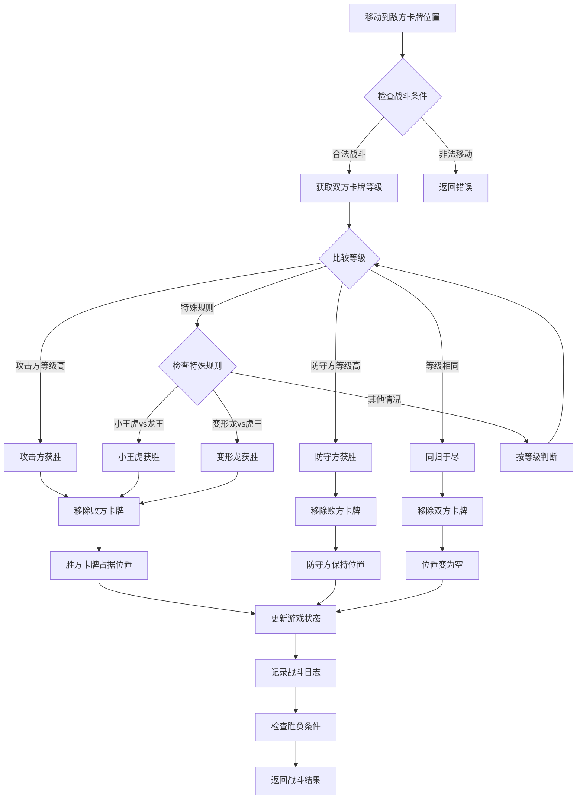
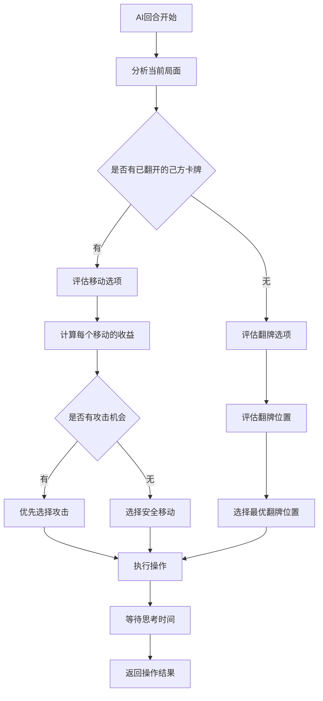

# 龙虎斗手机端网页小游戏 - 架构设计蓝图

## 1. 架构概述

### 1.1 项目架构
- **架构模式**: MVC (Model-View-Controller)
- **技术栈**: 原生JavaScript + HTML5 + CSS3
- **部署方式**: 静态网页，支持CDN分发
- **数据存储**: 浏览器本地存储 (LocalStorage + SessionStorage)

### 1.2 模块划分
```
src/
├── core/           # 核心游戏逻辑
├── ui/             # 用户界面组件
├── ai/             # AI对手逻辑
├── utils/          # 工具函数
├── assets/         # 静态资源
└── styles/         # 样式文件
```

## 2. 数据模型设计

### 2.1 卡牌数据模型 (Card)

```json
{
  "$schema": "http://json-schema.org/draft-07/schema#",
  "type": "object",
  "title": "Card",
  "properties": {
    "id": {
      "type": "string",
      "description": "卡牌唯一标识",
      "pattern": "^(dragon|tiger)_[1-8]$"
    },
    "name": {
      "type": "string",
      "description": "卡牌名称"
    },
    "faction": {
      "type": "string",
      "enum": ["dragon", "tiger"],
      "description": "阵营：龙或虎"
    },
    "level": {
      "type": "integer",
      "minimum": 1,
      "maximum": 8,
      "description": "卡牌等级"
    },
    "imagePath": {
      "type": "string",
      "description": "卡牌图片路径"
    },
    "isRevealed": {
      "type": "boolean",
      "description": "是否已翻开"
    },
    "position": {
      "$ref": "#/definitions/Position"
    },
    "owner": {
      "type": "string",
      "enum": ["player", "ai", null],
      "description": "卡牌归属"
    }
  },
  "required": ["id", "name", "faction", "level", "imagePath", "isRevealed", "position"],
  "definitions": {
    "Position": {
      "type": "object",
      "properties": {
        "row": {
          "type": "integer",
          "minimum": 0,
          "maximum": 4
        },
        "col": {
          "type": "integer",
          "minimum": 0,
          "maximum": 3
        }
      },
      "required": ["row", "col"]
    }
  }
}
```

### 2.2 游戏状态数据模型 (GameState)

```json
{
  "$schema": "http://json-schema.org/draft-07/schema#",
  "type": "object",
  "title": "GameState",
  "properties": {
    "id": {
      "type": "string",
      "description": "游戏会话ID"
    },
    "phase": {
      "type": "string",
      "enum": ["setup", "rock_paper_scissors", "faction_selection", "playing", "ended"],
      "description": "游戏阶段"
    },
    "currentPlayer": {
      "type": "string",
      "enum": ["player", "ai"],
      "description": "当前回合玩家"
    },
    "playerFaction": {
      "type": "string",
      "enum": ["dragon", "tiger", null],
      "description": "玩家阵营"
    },
    "aiFaction": {
      "type": "string",
      "enum": ["dragon", "tiger", null],
      "description": "AI阵营"
    },
    "board": {
      "type": "array",
      "items": {
        "type": "array",
        "items": {
          "oneOf": [
            {"$ref": "#/definitions/Card"},
            {"type": "null"}
          ]
        }
      },
      "description": "4x5游戏棋盘"
    },
    "selectedCard": {
      "oneOf": [
        {"$ref": "#/definitions/Position"},
        {"type": "null"}
      ],
      "description": "当前选中的卡牌位置"
    },
    "gameLog": {
      "type": "array",
      "items": {
        "$ref": "#/definitions/GameLogEntry"
      },
      "description": "游戏日志"
    },
    "winner": {
      "type": "string",
      "enum": ["player", "ai", "draw", null],
      "description": "游戏胜者"
    },
    "startTime": {
      "type": "string",
      "format": "date-time",
      "description": "游戏开始时间"
    },
    "endTime": {
      "type": "string",
      "format": "date-time",
      "description": "游戏结束时间"
    }
  },
  "required": ["id", "phase", "currentPlayer", "board", "gameLog"],
  "definitions": {
    "Card": {
      "type": "object",
      "properties": {
        "id": {"type": "string"},
        "name": {"type": "string"},
        "faction": {"type": "string"},
        "level": {"type": "integer"},
        "imagePath": {"type": "string"},
        "isRevealed": {"type": "boolean"},
        "position": {"$ref": "#/definitions/Position"},
        "owner": {"type": "string"}
      }
    },
    "Position": {
      "type": "object",
      "properties": {
        "row": {"type": "integer"},
        "col": {"type": "integer"}
      }
    },
    "GameLogEntry": {
      "type": "object",
      "properties": {
        "id": {"type": "string"},
        "timestamp": {"type": "string", "format": "date-time"},
        "type": {"type": "string", "enum": ["flip", "move", "battle", "game_start", "game_end", "turn_change"]},
        "player": {"type": "string", "enum": ["player", "ai"]},
        "action": {"type": "string"},
        "details": {"type": "object"}
      }
    }
  }
}
```

### 2.3 AI配置数据模型 (AIConfig)

```json
{
  "$schema": "http://json-schema.org/draft-07/schema#",
  "type": "object",
  "title": "AIConfig",
  "properties": {
    "difficulty": {
      "type": "string",
      "enum": ["easy", "medium", "hard"],
      "description": "AI难度级别"
    },
    "thinkingTime": {
      "type": "integer",
      "minimum": 500,
      "maximum": 3000,
      "description": "AI思考时间(毫秒)"
    },
    "strategy": {
      "type": "object",
      "properties": {
        "aggressiveness": {
          "type": "number",
          "minimum": 0,
          "maximum": 1,
          "description": "攻击性系数"
        },
        "exploration": {
          "type": "number",
          "minimum": 0,
          "maximum": 1,
          "description": "探索性系数"
        },
        "riskTolerance": {
          "type": "number",
          "minimum": 0,
          "maximum": 1,
          "description": "风险容忍度"
        }
      }
    }
  },
  "required": ["difficulty", "thinkingTime", "strategy"]
}
```

## 3. API接口契约

### 3.1 游戏管理API

| 接口名称 | 方法 | 路径 | 说明 |
|---------|------|------|------|
| 创建游戏 | POST | /api/game/create | 创建新游戏会话 |
| 获取游戏状态 | GET | /api/game/{gameId} | 获取当前游戏状态 |
| 更新游戏状态 | PUT | /api/game/{gameId} | 更新游戏状态 |
| 删除游戏 | DELETE | /api/game/{gameId} | 删除游戏会话 |

#### 3.1.1 创建游戏

**请求体:**
```json
{
  "mode": "ai", // "ai" | "online"
  "aiDifficulty": "medium", // "easy" | "medium" | "hard"
  "playerId": "player_123"
}
```

**响应体:**
```json
{
  "success": true,
  "data": {
    "gameId": "game_456",
    "gameState": {
      "id": "game_456",
      "phase": "setup",
      "currentPlayer": null,
      "playerFaction": null,
      "aiFaction": null,
      "board": [],
      "selectedCard": null,
      "gameLog": [],
      "winner": null,
      "startTime": "2025-01-20T10:00:00Z",
      "endTime": null
    }
  },
  "message": "游戏创建成功"
}
```

### 3.2 游戏操作API

| 接口名称 | 方法 | 路径 | 说明 |
|---------|------|------|------|
| 猜拳操作 | POST | /api/game/{gameId}/rock-paper-scissors | 执行猜拳决定先手 |
| 翻牌操作 | POST | /api/game/{gameId}/flip | 翻开指定位置的牌 |
| 移动操作 | POST | /api/game/{gameId}/move | 移动已翻开的卡牌 |
| 选择卡牌 | POST | /api/game/{gameId}/select | 选择要操作的卡牌 |
| 取消选择 | POST | /api/game/{gameId}/deselect | 取消卡牌选择 |

#### 3.2.1 翻牌操作

**请求体:**
```json
{
  "position": {
    "row": 0,
    "col": 1
  },
  "playerId": "player_123"
}
```

**响应体:**
```json
{
  "success": true,
  "data": {
    "flippedCard": {
      "id": "dragon_3",
      "name": "金龙",
      "faction": "dragon",
      "level": 3,
      "imagePath": "assets/cards/dragon_3.png",
      "isRevealed": true,
      "position": {"row": 0, "col": 1},
      "owner": "player"
    },
    "gameState": {
      // 更新后的完整游戏状态
    },
    "factionAssigned": true
  },
  "message": "翻牌成功，阵营确定为龙"
}
```

#### 3.2.2 移动操作

**请求体:**
```json
{
  "from": {
    "row": 0,
    "col": 1
  },
  "to": {
    "row": 1,
    "col": 1
  },
  "playerId": "player_123"
}
```

**响应体:**
```json
{
  "success": true,
  "data": {
    "moveResult": {
      "type": "move", // "move" | "battle" | "invalid"
      "battleResult": null, // 如果是战斗，包含战斗结果
      "eliminatedCards": []
    },
    "gameState": {
      // 更新后的完整游戏状态
    }
  },
  "message": "移动成功"
}
```

### 3.3 AI操作API

| 接口名称 | 方法 | 路径 | 说明 |
|---------|------|------|------|
| AI执行回合 | POST | /api/ai/{gameId}/turn | AI执行一个回合的操作 |
| 获取AI提示 | GET | /api/ai/{gameId}/hint | 获取AI对当前局面的分析 |

### 3.4 错误响应格式

```json
{
  "success": false,
  "error": {
    "code": "INVALID_MOVE",
    "message": "无效的移动操作",
    "details": {
      "reason": "目标位置被其他卡牌占据",
      "validMoves": [
        {"row": 1, "col": 0},
        {"row": 0, "col": 0}
      ]
    }
  }
}
```

## 4. 核心流程图

### 4.1 游戏整体流程

```mermaid
sequenceDiagram
    participant P as Player
    participant G as GameEngine
    participant AI as AIOpponent
    participant UI as UserInterface

    P->>G: 创建游戏
    G->>UI: 初始化界面
    
    P->>G: 猜拳选择
    G->>AI: AI猜拳选择
    G->>G: 决定先手玩家
    G->>UI: 显示先手结果
    
    alt 玩家先手
        P->>G: 翻牌操作
        G->>G: 确定阵营
        G->>UI: 更新界面
        
        loop 游戏回合
            alt 玩家回合
                P->>UI: 选择操作（翻牌/移动）
                UI->>G: 执行操作
                G->>G: 验证合法性
                G->>G: 更新游戏状态
                G->>UI: 更新界面
            else AI回合
                G->>AI: 请求AI操作
                AI->>AI: 分析局面
                AI->>G: 返回操作
                G->>G: 执行AI操作
                G->>UI: 更新界面
            end
            
            G->>G: 检查胜负条件
            alt 游戏结束
                G->>UI: 显示结果
                break
            end
        end
    else AI先手
        G->>AI: AI翻牌
        G->>G: 确定阵营
        G->>UI: 更新界面
        Note over G: 进入玩家回合循环
    end
```

### 4.2 战斗机制流程



### 4.3 AI决策流程



## 5. 组件交互说明

### 5.1 核心模块架构

```
GameEngine (游戏引擎)
├── GameState (游戏状态管理)
├── CardManager (卡牌管理器)
├── MoveValidator (移动验证器)
├── BattleResolver (战斗解析器)
└── WinConditionChecker (胜负判定器)

UIManager (界面管理器)
├── BoardRenderer (棋盘渲染器)
├── CardRenderer (卡牌渲染器)
├── AnimationController (动画控制器)
├── InputHandler (输入处理器)
└── UIStateManager (界面状态管理器)

AIOpponent (AI对手)
├── StrategyEngine (策略引擎)
├── MoveEvaluator (移动评估器)
├── PositionAnalyzer (局面分析器)
└── DecisionMaker (决策制定器)

ResourceManager (资源管理器)
├── ImageLoader (图片加载器)
├── CacheManager (缓存管理器)
├── AssetOptimizer (资源优化器)
└── ErrorHandler (错误处理器)
```

### 5.2 模块依赖关系

| 调用方模块 | 被调用模块 | 接口方法 | 调用场景 |
|-----------|-----------|----------|----------|
| UIManager | GameEngine | executeMove(), flipCard(), selectCard() | 用户操作响应 |
| GameEngine | CardManager | validateMove(), updatePosition() | 游戏逻辑执行 |
| GameEngine | BattleResolver | resolveBattle() | 战斗发生时 |
| GameEngine | WinConditionChecker | checkWinCondition() | 每次操作后 |
| AIOpponent | GameEngine | getGameState(), executeAIMove() | AI回合执行 |
| UIManager | ResourceManager | loadCardImage(), preloadAssets() | 界面渲染 |
| GameEngine | UIManager | updateUI(), showAnimation() | 状态变化通知 |

### 5.3 新增模块说明

由于这是新项目，所有模块都需要从零创建：

**核心文件结构:**
```
src/
├── core/
│   ├── GameEngine.js          # 游戏引擎主类
│   ├── GameState.js           # 游戏状态管理
│   ├── CardManager.js         # 卡牌管理器
│   ├── MoveValidator.js       # 移动验证器
│   ├── BattleResolver.js      # 战斗解析器
│   └── WinConditionChecker.js # 胜负判定器
├── ui/
│   ├── UIManager.js           # 界面管理器
│   ├── BoardRenderer.js       # 棋盘渲染器
│   ├── CardRenderer.js        # 卡牌渲染器
│   ├── AnimationController.js # 动画控制器
│   └── InputHandler.js        # 输入处理器
├── ai/
│   ├── AIOpponent.js          # AI对手主类
│   ├── StrategyEngine.js      # 策略引擎
│   ├── MoveEvaluator.js       # 移动评估器
│   └── PositionAnalyzer.js    # 局面分析器
├── utils/
│   ├── ResourceManager.js     # 资源管理器
│   ├── ImageLoader.js         # 图片加载器
│   ├── CacheManager.js        # 缓存管理器
│   └── Logger.js              # 日志管理器
└── main.js                    # 应用入口
```

## 6. 技术选型与风险

### 6.1 核心技术选型

| 技术域 | 选型 | 版本 | 选择理由 | 替代方案 |
|--------|------|------|----------|----------|
| 前端框架 | 原生JavaScript | ES6+ | 轻量、兼容性好、无构建依赖 | Vue.js, React |
| 模块系统 | ES6 Modules | - | 现代浏览器原生支持 | CommonJS, AMD |
| 样式框架 | CSS3 + CSS Grid | - | 响应式布局、移动端优化 | Flexbox, Bootstrap |
| 动画库 | CSS Animations + JS | - | 性能好、流畅度高 | GSAP, Anime.js |
| 状态管理 | 自定义EventEmitter | - | 简单有效、符合项目规模 | Redux, Vuex |
| 图片处理 | Canvas API | HTML5 | 图片优化、自适应处理 | SVG, WebP |
| 本地存储 | LocalStorage + SessionStorage | HTML5 | 简单可靠、浏览器支持好 | IndexedDB |
| AI算法 | Minimax + Alpha-Beta剪枝 | - | 经典游戏AI算法 | Monte Carlo Tree Search |

### 6.2 关键技术决策

#### 6.2.1 为什么选择原生JavaScript
- **优势**: 无构建步骤、加载速度快、兼容性好
- **劣势**: 开发效率相对较低
- **风险缓解**: 使用ES6+模块化、严格的代码规范

#### 6.2.2 AI算法选择
- **Minimax算法**: 适合回合制游戏，逻辑清晰
- **Alpha-Beta剪枝**: 优化性能，减少计算量
- **评估函数**: 基于卡牌价值、位置优势、攻击机会

#### 6.2.3 图片资源处理策略
- **预加载**: 游戏开始前加载所有卡牌图片
- **懒加载**: 按需加载非关键资源
- **缓存策略**: 浏览器缓存 + Service Worker
- **格式选择**: WebP优先，PNG/JPG降级

### 6.3 技术风险评估

| 风险类别 | 风险描述 | 影响程度 | 发生概率 | 缓解措施 |
|----------|----------|----------|----------|----------|
| 性能风险 | 移动端性能不佳 | 高 | 中 | 图片优化、代码分割、性能监控 |
| 兼容性风险 | 旧浏览器不支持ES6+ | 中 | 低 | Babel转译、Polyfill |
| 内存泄漏 | 长时间游戏导致内存泄漏 | 中 | 中 | 及时清理事件监听器、对象引用 |
| AI性能 | AI计算时间过长 | 中 | 低 | 异步计算、Web Worker |
| 图片加载 | 网络较差时图片加载失败 | 低 | 中 | 重试机制、默认图片 |
| 状态同步 | 游戏状态不一致 | 高 | 低 | 状态验证、日志记录 |

### 6.4 性能优化策略

#### 6.4.1 渲染优化
- 使用CSS3硬件加速
- 避免频繁的DOM操作
- 使用requestAnimationFrame优化动画
- 虚拟化长列表（如果需要）

#### 6.4.2 内存优化
- 对象池复用
- 及时清理事件监听器
- 避免闭包内存泄漏
- 图片资源的及时释放

#### 6.4.3 加载优化
- 关键资源优先加载
- 图片压缩和格式优化
- 代码分割和按需加载
- Service Worker缓存策略

### 6.5 扩展性考虑

#### 6.5.1 在线对战支持
- WebSocket连接管理
- 房间系统设计
- 断线重连机制
- 同步策略

#### 6.5.2 多语言支持
- 国际化(i18n)框架
- 动态语言切换
- 文本资源管理

#### 6.5.3 主题系统
- CSS变量动态切换
- 主题配置管理
- 资源路径映射

## 7. 开发计划

### 7.1 里程碑规划

| 里程碑 | 主要功能 | 预计时间 | 交付物 |
|--------|----------|----------|---------|
| M1 | 核心游戏逻辑 | 3天 | 游戏引擎、基础UI |
| M2 | AI对手系统 | 2天 | AI算法、人机对战 |
| M3 | 完整UI实现 | 2天 | 完整界面、动画效果 |
| M4 | 优化和测试 | 1天 | 性能优化、bug修复 |
| M5 | 在线对战(可选) | 3天 | WebSocket、房间系统 |

### 7.2 风险控制
- 每日进度检查
- 关键节点代码审查
- 性能基准测试
- 多设备兼容性测试

---

**文档版本**: v1.0  
**创建日期**: 2025年1月20日  
**架构师**: 解决方案架构师  

此架构蓝图为龙虎斗手机端网页小游戏的完整技术方案，包含了数据模型、API设计、核心流程、组件架构和技术选型的详细说明。后续开发将严格按照此蓝图执行，确保项目的稳定性和可扩展性。
