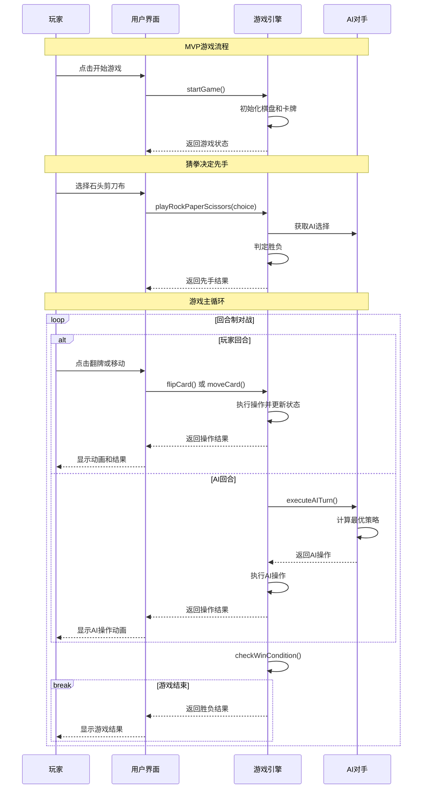
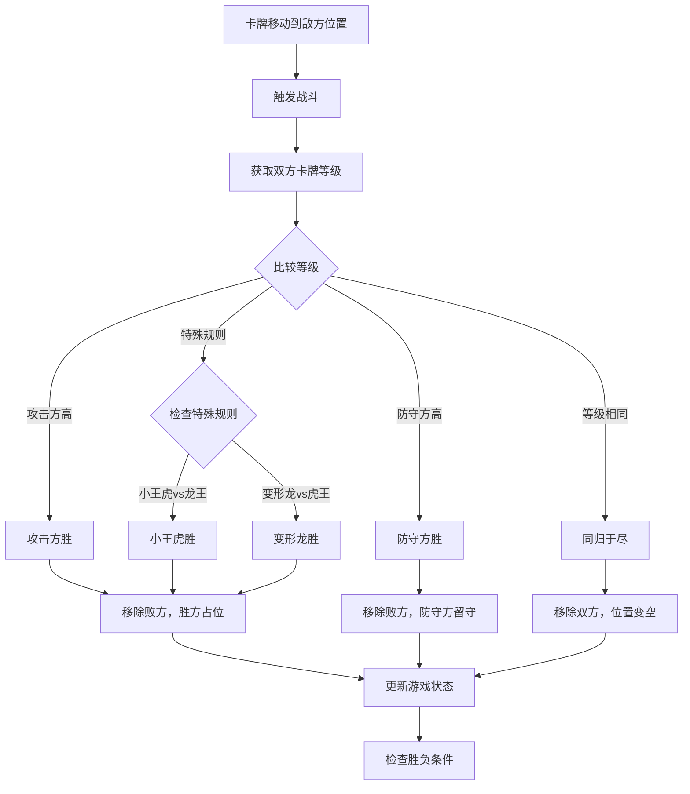
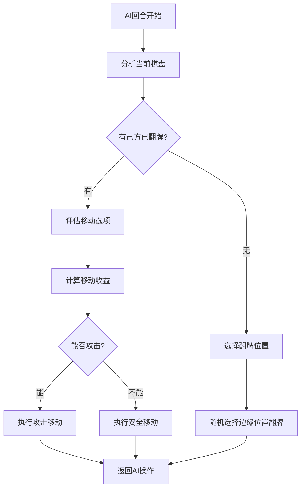
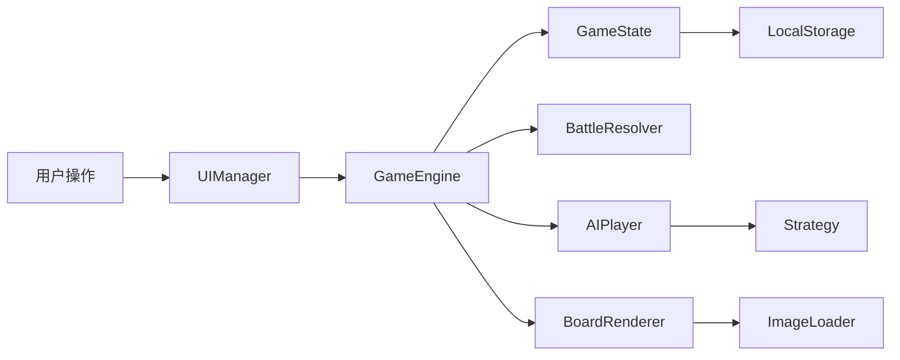

# 龙虎斗手机端网页小游戏 - MVP架构蓝图 (Epic)

## 1. 代码库分析

### 1.1 当前状态
- **项目类型**: 全新项目，无现有代码
- **现有文件**: 仅包含PRD.md需求文档和design.md架构文档
- **技术债务**: 无
- **依赖关系**: 无外部依赖

### 1.2 MVP目标
基于PRD第11.1节的MVP功能清单：
1. ✅ 基础游戏逻辑实现  
2. ✅ 图片资源加载系统
3. ✅ 人机对战功能
4. ✅ 猜拳决定先手
5. ✅ 基础UI界面
6. ✅ 移动端适配

## 2. MVP数据模型设计

### 2.1 简化卡牌模型 (Card)

```javascript
// 核心卡牌数据结构
class Card {
  constructor(id, faction, level) {
    this.id = id;                    // "dragon_1" | "tiger_1" 等
    this.faction = faction;          // "dragon" | "tiger"
    this.level = level;              // 1-8
    this.name = this.getCardName();  // 根据ID获取中文名
    this.isRevealed = false;         // 是否已翻开
    this.position = { row: -1, col: -1 }; // 位置坐标
    this.owner = null;               // "player" | "ai" | null
  }
  
  getCardName() {
    const names = {
      dragon: ["龙王", "神龙", "金龙", "青龙", "赤龙", "白龙", "风雨龙", "变形龙"],
      tiger: ["虎王", "东北虎", "大头虎", "下山虎", "壕虎", "妖虎", "白虎", "小王虎"]
    };
    return names[this.faction][this.level - 1];
  }
  
  getImagePath() {
    return `assets/cards/${this.id}.png`;
  }
}
```

### 2.2 MVP游戏状态模型 (GameState)

```javascript
// 简化游戏状态管理
class GameState {
  constructor() {
    this.phase = "setup";              // "setup" | "rps" | "playing" | "ended"
    this.currentPlayer = null;         // "player" | "ai"
    this.playerFaction = null;         // "dragon" | "tiger" | null
    this.aiFaction = null;             // "dragon" | "tiger" | null
    this.board = this.initBoard();     // 4x5二维数组
    this.selectedPosition = null;      // {row, col} | null
    this.gameLog = [];                 // 操作日志数组
    this.winner = null;                // "player" | "ai" | "draw" | null
    this.cardsData = this.initCards(); // 16张卡牌数据
  }
  
  initBoard() {
    // 创建4x5棋盘，第3行(index=2)为空行
    return Array(5).fill(null).map((_, row) => 
      row === 2 ? Array(4).fill(null) : Array(4).fill(undefined)
    );
  }
  
  initCards() {
    const cards = [];
    // 创建龙阵营8张牌
    for (let i = 1; i <= 8; i++) {
      cards.push(new Card(`dragon_${i}`, "dragon", i));
    }
    // 创建虎阵营8张牌  
    for (let i = 1; i <= 8; i++) {
      cards.push(new Card(`tiger_${i}`, "tiger", i));
    }
    return this.shuffleCards(cards);
  }
  
  shuffleCards(cards) {
    // Fisher-Yates洗牌算法
    for (let i = cards.length - 1; i > 0; i--) {
      const j = Math.floor(Math.random() * (i + 1));
      [cards[i], cards[j]] = [cards[j], cards[i]];
    }
    return cards;
  }
}
```

### 2.3 MVP AI配置 (简化版)

```javascript
// 简化AI配置
const AI_CONFIG = {
  thinkingTime: 1000,        // AI思考时间1秒
  difficulty: "medium",      // 固定中等难度
  strategy: {
    exploration: 0.3,        // 探索系数
    aggression: 0.6,         // 攻击系数
    safety: 0.7              // 安全系数
  }
};
```

## 3. MVP API接口契约

### 3.1 核心游戏操作接口

| 操作类型 | 方法名 | 输入参数 | 返回值 | 说明 |
|---------|--------|----------|--------|------|
| 开始游戏 | `startGame()` | 无 | `GameState` | 初始化新游戏 |
| 猜拳操作 | `playRockPaperScissors(choice)` | `choice: string` | `{winner, playerChoice, aiChoice}` | 决定先手 |
| 翻牌操作 | `flipCard(row, col)` | `row: number, col: number` | `{success, card, gameState}` | 翻开指定位置的牌 |
| 选择卡牌 | `selectCard(row, col)` | `row: number, col: number` | `{success, validMoves}` | 选择已翻开的己方卡牌 |
| 移动卡牌 | `moveCard(fromRow, fromCol, toRow, toCol)` | `from/to: number` | `{success, battleResult, gameState}` | 移动卡牌到目标位置 |
| AI执行回合 | `executeAITurn()` | 无 | `{action, result, gameState}` | AI执行一个回合 |
| 检查胜负 | `checkWinCondition()` | 无 | `{isGameOver, winner, reason}` | 判断游戏是否结束 |

### 3.2 接口详细定义

#### 3.2.1 翻牌操作
```javascript
/**
 * 翻牌操作
 * @param {number} row - 行索引 (0-4)
 * @param {number} col - 列索引 (0-3)
 * @returns {Object} 操作结果
 */
function flipCard(row, col) {
  return {
    success: true,
    card: {
      id: "dragon_3",
      name: "金龙", 
      faction: "dragon",
      level: 3,
      position: {row, col}
    },
    factionAssigned: true,  // 是否首次确定阵营
    gameState: "updated_game_state"
  };
}
```

#### 3.2.2 移动操作
```javascript
/**
 * 移动卡牌
 * @param {number} fromRow - 起始行
 * @param {number} fromCol - 起始列  
 * @param {number} toRow - 目标行
 * @param {number} toCol - 目标列
 * @returns {Object} 移动结果
 */
function moveCard(fromRow, fromCol, toRow, toCol) {
  return {
    success: true,
    moveType: "battle",  // "move" | "battle"
    battleResult: {
      winner: "attacker",  // "attacker" | "defender" | "draw"
      attackerCard: "dragon_5",
      defenderCard: "tiger_3", 
      eliminatedCards: ["tiger_3"]
    },
    gameState: "updated_game_state"
  };
}
```

### 3.3 错误处理

```javascript
// 统一错误格式
const ERROR_CODES = {
  INVALID_POSITION: "位置坐标无效",
  CARD_ALREADY_REVEALED: "卡牌已经翻开", 
  NOT_YOUR_TURN: "不是你的回合",
  INVALID_MOVE: "无效的移动",
  CARD_NOT_SELECTED: "未选择卡牌",
  GAME_NOT_STARTED: "游戏未开始"
};

function createError(code, details = {}) {
  return {
    success: false,
    error: {
      code,
      message: ERROR_CODES[code],
      details
    }
  };
}
```

## 4. 核心流程图

### 4.1 MVP游戏主流程



### 4.2 MVP战斗机制流程



### 4.3 MVP AI决策流程



## 5. MVP组件架构设计

### 5.1 核心模块结构

```
dragon_vs_tiger/
├── index.html              # 主页面入口
├── assets/                  # 静态资源目录
│   ├── cards/              # 卡牌图片 (由产品方提供)
│   │   ├── dragon_1.png    # 龙王
│   │   ├── dragon_2.png    # 神龙
│   │   ├── ...             # 其他卡牌
│   │   ├── tiger_8.png     # 小王虎
│   │   └── card_back.png   # 卡牌背面
│   └── images/             # 其他图片资源
├── styles/                 # 样式文件
│   ├── main.css           # 主样式
│   ├── game-board.css     # 棋盘样式  
│   └── mobile.css         # 移动端适配
├── scripts/               # JavaScript代码
│   ├── main.js           # 应用入口
│   ├── core/             # 核心游戏逻辑
│   │   ├── GameEngine.js # 游戏引擎主类
│   │   ├── GameState.js  # 游戏状态管理
│   │   ├── Card.js       # 卡牌类定义
│   │   └── BattleResolver.js # 战斗逻辑
│   ├── ui/               # 用户界面
│   │   ├── UIManager.js  # 界面管理器
│   │   ├── BoardRenderer.js # 棋盘渲染
│   │   └── AnimationController.js # 动画控制
│   ├── ai/               # AI系统
│   │   ├── AIPlayer.js   # AI玩家类
│   │   └── Strategy.js   # AI策略
│   └── utils/            # 工具函数
│       ├── ImageLoader.js # 图片加载器
│       └── Logger.js     # 日志工具
└── README.md             # 项目说明
```

### 5.2 模块依赖关系

| 模块名称 | 依赖模块 | 接口调用 | 调用场景 |
|---------|---------|----------|----------|
| main.js | UIManager, GameEngine | init(), startGame() | 应用启动 |
| UIManager | GameEngine, AnimationController | executeMove(), showAnimation() | 用户交互 |
| GameEngine | GameState, BattleResolver, AIPlayer | updateState(), resolveBattle() | 游戏逻辑 |
| AIPlayer | GameState, Strategy | analyzeBoard(), makeMove() | AI回合 |
| BoardRenderer | ImageLoader | loadCardImage() | 界面渲染 |
| AnimationController | 无 | playFlipAnimation(), playMoveAnimation() | 动画播放 |

### 5.3 数据流向图



## 6. MVP技术选型与风险

### 6.1 技术栈选择

| 技术层 | 选型 | 版本要求 | 选择理由 | MVP风险评估 |
|--------|------|----------|----------|-------------|
| **前端框架** | 原生JavaScript | ES6+ | 零依赖、快速启动、学习成本低 | 🟢 低风险 |
| **模块系统** | ES6 Modules | - | 浏览器原生支持、代码组织清晰 | 🟢 低风险 |
| **样式方案** | CSS3 + Grid | - | 响应式布局、移动端友好 | 🟢 低风险 |
| **动画方案** | CSS Transitions | - | 性能好、实现简单 | 🟢 低风险 |
| **状态管理** | 类实例 + EventEmitter | - | 简单直接、符合MVP规模 | 🟢 低风险 |
| **数据持久化** | LocalStorage | HTML5 | 简单可靠、无服务器依赖 | 🟡 中风险 |
| **图片加载** | 原生Image API | - | 浏览器原生支持 | 🟡 中风险 |
| **AI算法** | 简化规则引擎 | - | 易实现、满足MVP需求 | 🟢 低风险 |

### 6.2 MVP技术决策

#### 6.2.1 选择原生JavaScript的原因
- ✅ **快速开发**: 无构建配置，直接编码
- ✅ **零学习成本**: 团队成员都熟悉原生JS
- ✅ **部署简单**: 静态文件，支持任意web服务器
- ✅ **调试方便**: 浏览器原生开发工具支持
- ⚠️ **扩展性限制**: 后续功能增加可能需要重构

#### 6.2.2 简化AI实现策略
MVP阶段采用规则驱动的简化AI：
```javascript
// MVP AI策略：规则驱动 + 随机选择
class SimplifiedAI {
  makeMove(gameState) {
    // 1. 优先攻击能赢的敌方卡牌
    const attackMoves = this.findWinningAttacks(gameState);
    if (attackMoves.length > 0) {
      return this.selectBestAttack(attackMoves);
    }
    
    // 2. 寻找安全的移动
    const safeMoves = this.findSafeMoves(gameState);
    if (safeMoves.length > 0) {
      return this.randomSelect(safeMoves);
    }
    
    // 3. 随机翻牌
    return this.randomFlip(gameState);
  }
}
```

### 6.3 MVP风险识别与缓解

| 风险类别 | 具体风险 | 影响 | 概率 | 缓解措施 |
|---------|---------|------|------|----------|
| **技术风险** | 图片加载失败 | 中 | 中 | 默认图片降级、重试机制 |
| **性能风险** | 移动端卡顿 | 高 | 低 | CSS硬件加速、图片压缩 |
| **兼容性风险** | 旧浏览器不支持ES6 | 中 | 低 | 目标现代移动浏览器 |
| **数据风险** | 游戏状态丢失 | 低 | 低 | LocalStorage自动保存 |
| **用户体验** | 操作响应延迟 | 中 | 低 | 即时UI反馈、动画优化 |

### 6.4 MVP性能基准

| 性能指标 | 目标值 | 测试方法 | 优化策略 |
|---------|--------|----------|----------|
| 首屏加载时间 | < 2秒 | Chrome DevTools | 图片预加载、CSS内联 |
| 图片加载时间 | < 1秒 | 模拟慢速网络 | 图片压缩、WebP格式 |
| 操作响应时间 | < 100ms | 点击到视觉反馈 | CSS硬件加速 |
| AI思考时间 | 1秒固定 | AI回合计时 | 简化算法、异步处理 |
| 内存占用 | < 50MB | 浏览器任务管理器 | 及时清理、对象复用 |

## 7. MVP开发里程碑

### 7.1 开发计划 (5天Sprint)

| 天数 | 里程碑 | 主要任务 | 交付物 | 验收标准 |
|------|--------|----------|---------|----------|
| **Day 1** | 基础架构 | 项目结构、核心类定义 | 文件结构、Card/GameState类 | 能创建游戏实例 |
| **Day 2** | 游戏逻辑 | 翻牌、移动、战斗机制 | GameEngine、BattleResolver | 能完成完整对局 |
| **Day 3** | 用户界面 | 棋盘渲染、交互逻辑 | UIManager、BoardRenderer | 能手动操作游戏 |
| **Day 4** | AI对手 | 简化AI、人机对战 | AIPlayer、Strategy | 能人机对战 |
| **Day 5** | 优化测试 | 动画、移动端适配、测试 | 完整MVP | 通过验收测试 |

### 7.2 验收清单

#### 功能验收
- [ ] 游戏能正常启动和初始化
- [ ] 猜拳决定先手功能正常
- [ ] 翻牌操作正确显示卡牌和确定阵营
- [ ] 移动操作符合游戏规则
- [ ] 战斗机制正确执行（包括特殊规则）
- [ ] AI能够自动执行合理操作
- [ ] 胜负判定逻辑正确
- [ ] 游戏状态能正确保存和恢复

#### 性能验收  
- [ ] 在主流移动浏览器中流畅运行
- [ ] 首屏加载时间 < 2秒
- [ ] 操作响应时间 < 100ms
- [ ] 不存在明显的内存泄漏

#### 用户体验验收
- [ ] 界面适配手机屏幕
- [ ] 操作逻辑直观易懂
- [ ] 视觉反馈及时准确
- [ ] 动画效果流畅自然

## 8. 部署和监控

### 8.1 MVP部署方案
- **部署方式**: 静态文件部署
- **服务器要求**: 支持HTTP/HTTPS的Web服务器
- **CDN支持**: 可选，用于加速图片加载
- **域名**: 可使用GitHub Pages等免费托管

### 8.2 监控指标
- **用户行为**: 游戏启动率、完成率
- **性能指标**: 页面加载时间、操作响应时间  
- **错误监控**: JavaScript错误、资源加载失败
- **设备兼容**: 不同设备和浏览器的表现

---

**Epic版本**: MVP v1.0  
**创建日期**: 2025年1月20日  
**架构师**: 解决方案架构师  
**开发周期**: 5天Sprint  

此MVP架构蓝图专注于核心功能的快速实现，确保在最短时间内交付可用的游戏产品。所有技术选型都以简单、可靠、快速开发为原则，为后续功能扩展预留了充分的架构空间。
